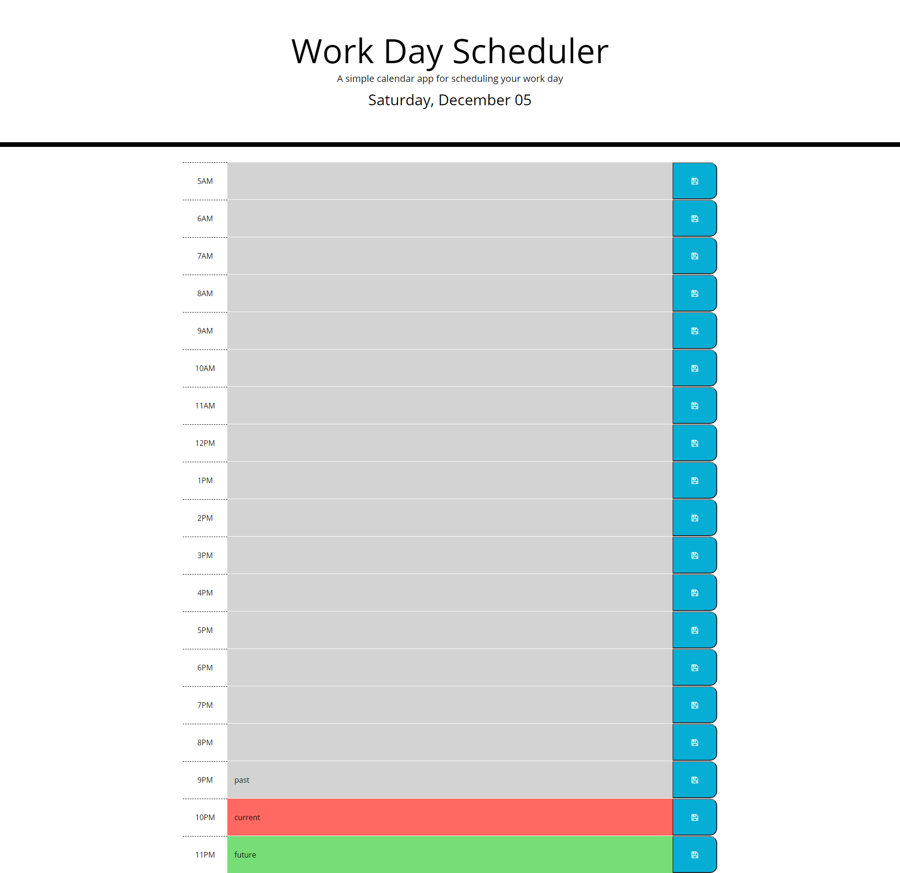

# Daily Planner

## Function
* Daily schedule for workday events.
* Hourly time slots that are dynamically created.
* Save function to allow text to persist upon page refresh.
* Date that is created using luxon to automatically match current local date.

### Built With
* HTML
* CSS
* JavaScript
* Luxon
* jQuery
* Bootstrap

### Link
[Deployed application](https://corycalaway.github.io/daily-planner/)

### Daily Planner Layout
